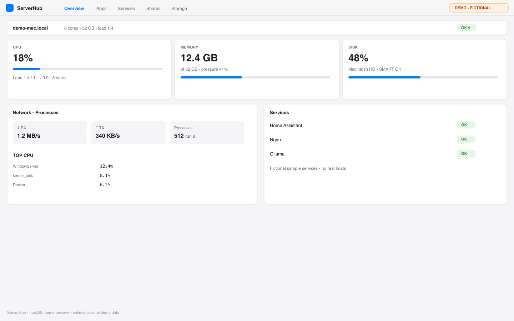
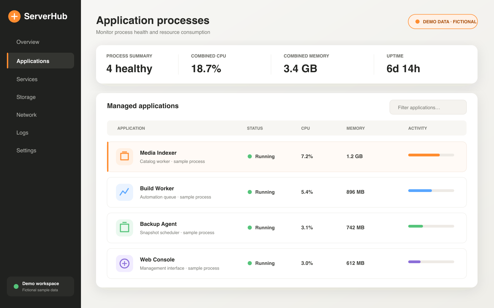

# ServerHub v3.9.1

macOS 家庭服务器管理面板 — 对标 **Unraid** 信息架构，并吸收 **Dockge / Portainer / Glances / Glance / Heimdall / CasaOS / Homebrew** 等开源优秀能力。

**面板：** 默认访问地址是 `http://localhost:8086`。进程默认绑定 `127.0.0.1:8086`（仅本机）。局域网直连时设置 `SERVERHUB_HOST=0.0.0.0`。设置完成后必须登录。远程访问请通过启用 TLS 与身份策略的 Cloudflare Tunnel/反向代理，勿把未加保护的 8086 直接暴露到公网。

## 界面展示

> 以下图片使用完全虚构的演示数据，不包含真实账号、用户名、IP 地址、主机名、令牌或服务配置。

### 系统概览



### 应用进程



## 模块地图（`/modules`）

| 类别 | 模块 | 灵感 |
|------|------|------|
| 系统 | 仪表盘、服务、**Brew**、传感器 | Unraid / Glances / Homebrew |
| 容器 | Docker 表、**Compose 编辑器**、应用目录 | dockerMan / **Dockge** / Portainer / CA |
| 存储 | 存储阵列、共享 | Unraid Main / OMV |
| 网络 | 接口 / 端口 / 路由 | Unraid Network |
| 应用 | **书签健康探测** | **Heimdall / Homarr / Glance** |
| 运维 | 日志、告警、备份、工具、维护 | Unraid Tools + Notifications |

## 本版亮点

### Compose（Dockge 风）
- 栈列表 + **YAML 在线编辑**
- `docker compose config` **校验**
- 保存自动 `.bak`
- 新建栈写入 `~/Services/<id>/`
- Up / Down / 更新任务日志

### Homebrew（macOS 特色）
- `brew services list --json`
- 启动 / 停止 / 重启 grafana、postgres、mosquitto 等

### 书签探测（Homarr 风）
- 对 `quick_links` + overrides URL 做 HTTP 探测
- 延迟 ms、401/403 视为在线、自签 HTTPS 兼容
- 仪表盘磁贴 + `/bookmarks` 页

### 传感器（Glances 风）
- CPU user/sys/idle、负载、内存、根盘
- `/api/system/sensors`

### 模块注册表
- `/api/modules` 可发现所有能力与灵感来源

## 技术

- FastAPI 包 `hub/` + Vue 3 (`web/` → `static/`)
- 容器引擎：**OrbStack**
- 菜单栏：原生 `macos/ServerHubLauncher.swift`；`menubar.py` 为旧版实现

## 快速开始

需要 macOS 13+、Python 3.10+；若需从源码重建前端，还需 Node.js 18、20 或 22+ 与 npm。

```bash
git clone https://github.com/elvin-li/ServerHub.git
cd ServerHub
./install.sh
open http://localhost:8086
```

安装脚本会创建本地虚拟环境、保留已有 `services.yaml`，并生成仅存于本机且已被 Git 忽略的认证令牌。首次打开时请使用 `data/.setup-token` 完成管理员设置。

通过 Cloudflare Tunnel 或反向代理访问时，首次设置**必须**填写该令牌：代理连到 `127.0.0.1` 并不等于“人在这台 Mac 上”。本机浏览器打开 `http://localhost:8086` 时，面板会自动填入令牌。

常用环境变量（LaunchAgent 的 `EnvironmentVariables` 或 shell）：

| 变量 | 默认 | 作用 |
|------|------|------|
| `SERVERHUB_HOST` | `127.0.0.1` | 监听地址。设为 `0.0.0.0` 则局域网可达 |
| `SERVERHUB_PORT` | `8086` | TCP 端口 |
| `SERVERHUB_TRUSTED_PROXIES` | `127.0.0.1/32,::1/128` | 可信任的反向代理 CIDR；仅这些对端的 `X-Forwarded-For` / `CF-Connecting-IP` 会用于登录限速与审计 |

`GET /api/health` 是存活探测（不跑主机发现）。完整清单用 `GET /api/status`。响应带 `X-Request-ID`，日志行里也能看到同一个 id。

卸载时运行 `./uninstall.sh`；使用 `--purge` 会额外删除本地配置和运行数据。

## 原生 macOS 菜单栏

原生菜单栏 App 可安装到系统或当前用户的 Applications 目录。用户目录安装不需要覆盖 `/Applications`：

```bash
mkdir -p "$HOME/Applications"
./macos/build_app.sh "$HOME/Applications/ServerHub.app"
open "$HOME/Applications/ServerHub.app"
```

App 跟随 macOS 首选语言：中文语言环境显示简体中文菜单，其他语言环境显示英文。开发和快照测试可通过 `SERVERHUB_LANGUAGE=zh-Hans` 或 `SERVERHUB_LANGUAGE=en` 显式覆盖；空值会回退到系统语言。

面板的“设置 → 面板”页可查看 App、菜单栏进程、后台面板与登录自启状态，并可打开 App、切换登录自启、重启或停止面板。停止面板后，重新打开 `ServerHub.app` 即可恢复；状态读取失败时可使用卡片中的刷新按钮重试。

## 开发

以下命令均从仓库根目录 `~/Services/serverhub` 执行：

```bash
# 后端行为测试
.venv/bin/python -m unittest discover -s tests -p 'test_*.py'

# 前端测试、死代码检查和生产构建
npm --prefix web test
npm --prefix web run check:dead-code
npm --prefix web run build

# Python 未使用代码检查
.venv/bin/python -m pyflakes hub tests app.py menubar.py
.venv/bin/python -m vulture hub tests app.py menubar.py --min-confidence 100
```

生产构建输出到 `static/`。Vite 构建会校验首屏入口 JavaScript 不超过 150 KiB，超出直接构建失败；该预算只应下调，需要上调时应当改为把路由或依赖拆出入口。所有页面（含 `/` 与 `/login`）都是按需加载的 chunk，`main.js` 启动时会并行预热当前 URL 对应的那一个，因此懒加载不会给首屏多加一次串行往返。英语词典作为同步回退，中、日文词典按当前语言异步加载。修改词典时须保持三种语言的键和占位符一致，`npm --prefix web test` 会验证该契约。

构建确认无误后，如需重启本机 LaunchAgent，可自动匹配当前实际安装的标签。面板任务历史上使用过三种命名：`install.sh` 写入 `local.serverhub.panel`，原生 ServerHub.app 写入 `local.serverhub`，早期发行安装为 `com.elvin.serverhub`。下面的片段依次探测，命中即重启：

```bash
DOMAIN="gui/$(id -u)"
for label in local.serverhub.panel local.serverhub com.elvin.serverhub; do
  if launchctl print "$DOMAIN/$label" >/dev/null 2>&1; then
    launchctl kickstart -k "$DOMAIN/$label"
    echo "restarted $label"
    break
  fi
done
```

## 模板目录 `templates/`

uptime-kuma · portainer · navidrome · adguard-home · cloudflared · homarr · glance · dockge · filebrowser
