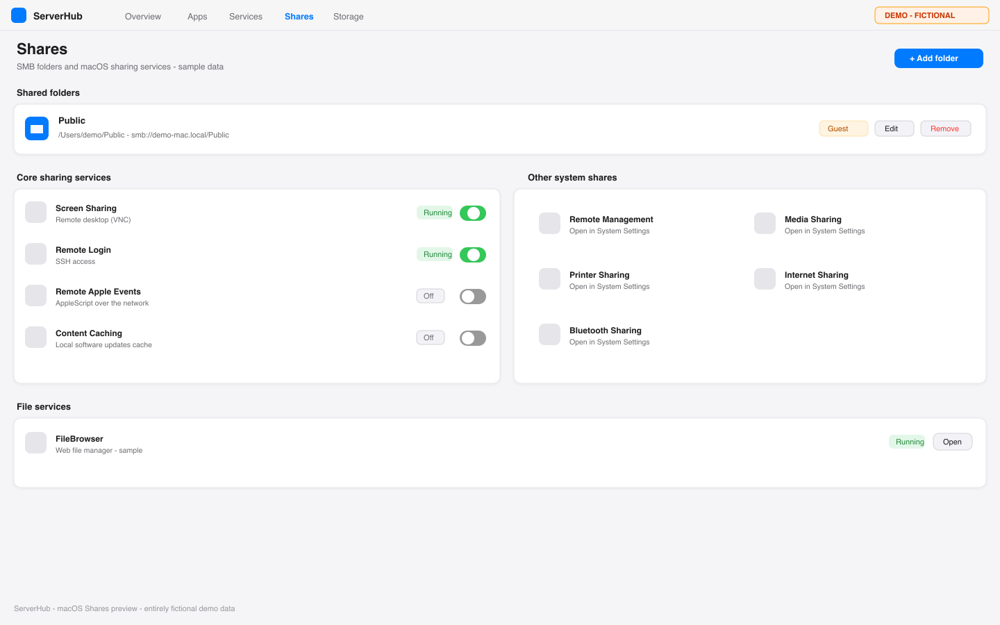

# ServerHub v3.9.1

A home-server management panel for macOS — modelled on **Unraid**'s information architecture, with ideas borrowed from **Dockge / Portainer / Glances / Glance / Heimdall / CasaOS / Homebrew**.

**Panel:** binds `127.0.0.1:8086` by default (this Mac only). Set `SERVERHUB_HOST=0.0.0.0` for LAN access. Sign-in is mandatory once setup completes. Do not expose port 8086 to the internet directly: put it behind a Cloudflare Tunnel or a reverse proxy that terminates TLS and enforces an identity policy.

## Screenshots

> The images below use entirely fictional demo data. They contain no real accounts, usernames, IP addresses, hostnames, tokens or service configuration.

### System overview (macOS theme)


### Shares (macOS theme)



### Apps and processes


## Feature overview

| Area | What you get | Details |
|------|------|------|
| Dashboard | live tiles, UPS power tile, metrics charts from **1 hour to 1 year** (tiered 90s/5min/1h history) | [docs/metrics.md](docs/metrics.md) |
| Storage | disk inventory/format/mount, SMART attributes + scheduled self-tests, AppleRAID, APFS snapshots, usage analytics, Time Machine control | — |
| Shares | SMB share CRUD (guest/read-only/encryption), **Time Machine backup destinations with quotas**, per-user access via filesystem ACLs, NFS exports | [docs/time-machine.md](docs/time-machine.md) |
| Containers & apps | full container lifecycle (OrbStack), Dockge-style Compose editing with validation, **50-template app catalog + optional remote template source**, credentials tracking, autostart policy | [docs/app-catalog.md](docs/app-catalog.md) |
| Services | auto-discovery of launchd/Homebrew/Docker/UTM services, recognition of common daemons, **adoption** into managed entries | [docs/app-catalog.md](docs/app-catalog.md) |
| Scheduler | user-defined **cron jobs** (shell / rsync / stack backup / APFS snapshot), run history, failure alerts | [docs/scheduler-and-backups.md](docs/scheduler-and-backups.md) |
| Backups | **rsync push/pull with dry-run preview** (brew rsync 3.x / openrsync auto-detected), **Compose stack backups** (stop → archive → always restart, crash-safe), database/config archives with restore hints | [docs/scheduler-and-backups.md](docs/scheduler-and-backups.md) |
| Notifications | **SMTP / ntfy / Telegram / Discord / Slack / webhook / Home Assistant**, per-channel severity routing and tests | [docs/notifications.md](docs/notifications.md) |
| UPS | native USB UPS monitoring (pmset), power-loss/low-battery alerts, **safe-shutdown policy** (ordered graceful stop + auto-restore) layered above the macOS halt threshold | [docs/ups.md](docs/ups.md) |
| Users & security | mandatory auth, **multi-user (admin/member) with per-service grants**, **TOTP 2FA with recovery codes**, **hashed API keys**, audit trail, session revocation | [docs/authentication.md](docs/authentication.md) |
| Network | interfaces/DHCP/DNS/aliases/failover/Wi-Fi, WireGuard (peers, pf forwarding, self-healing), Cloudflare Tunnel, bookmark health probes | — |
| Tools | diagnostics bundle, web terminal (host + containers, audited), health checks, logs, alerts, maintenance tasks, module registry (`/api/modules`) | — |

Member accounts see a reduced panel (Dashboard, their granted services, and a
self-service Account page for password and 2FA).

## Documentation

- [Notifications](docs/notifications.md) — channels, severity routing, where secrets live
- [Scheduler and backups](docs/scheduler-and-backups.md) — cron semantics, rsync, stack backups
- [Time Machine destinations](docs/time-machine.md) — serving TM backups to other Macs
- [UPS](docs/ups.md) — monitoring, alerts, the two-layer safe-shutdown design
- [Authentication](docs/authentication.md) — setup, multi-user, 2FA, API keys, share ACLs
- [Metrics](docs/metrics.md) — tiered long-term history and the query API
- [App catalog](docs/app-catalog.md) — templates, placeholders, the remote-source trust model
- [Upgrading](docs/upgrade.md) — the supported upgrade procedure per install flavour, and rollback via git

## Stack

- FastAPI package `hub/` + Vue 3 (`web/` → `static/`)
- Container engine: **OrbStack**
- Menu bar: native `macos/ServerHubLauncher.swift`; `menubar.py` is the legacy implementation
- No third-party auth/crypto/scheduling dependencies: TOTP, API-key hashing, cron matching and notification senders are standard-library implementations (see `requirements.txt`)

## Quick start

Requires macOS 13+ and Python 3.10+. Rebuilding the frontend from source additionally needs Node.js 18, 20 or 22+ with npm.

```bash
git clone https://github.com/elvin-li/ServerHub.git
cd ServerHub
./install.sh
open http://localhost:8086
```

The install script creates a local virtual environment, preserves an existing `services.yaml`, and generates authentication tokens that stay on this machine and are gitignored. On first launch, use `data/.setup-token` to complete administrator setup.

When the panel is reached through a Cloudflare Tunnel or reverse proxy, first-run setup **must** present that token: a proxy hop to `127.0.0.1` is not the same as a person on this Mac. Opening `http://localhost:8086` in a browser on this machine auto-fills the token.

Common environment variables (LaunchAgent `EnvironmentVariables` or the shell):

| Variable | Default | Role |
|----------|---------|------|
| `SERVERHUB_HOST` | `127.0.0.1` | Bind address. Set `0.0.0.0` for LAN reachability |
| `SERVERHUB_PORT` | `8086` | TCP port |
| `SERVERHUB_TRUSTED_PROXIES` | `127.0.0.1/32,::1/128` | Reverse-proxy CIDRs whose `X-Forwarded-For` / `CF-Connecting-IP` are used for login rate-limits and audit |

`GET /ready` is an unauthenticated liveness probe (no host discovery). `GET /api/health` stays the tiny watchdog/install probe on this tree. Full inventory is `GET /api/status`. Responses carry `X-Request-ID`, which also appears in log lines.

To uninstall, run `./uninstall.sh`; adding `--purge` also removes local configuration and runtime data.

## Native macOS menu bar

The native menu-bar app can be installed system-wide or into the current user's Applications directory. A per-user install does not need write access to `/Applications`:

```bash
mkdir -p "$HOME/Applications"
./macos/build_app.sh "$HOME/Applications/ServerHub.app"
open "$HOME/Applications/ServerHub.app"
```

The app follows the macOS preferred language: Chinese locales get a Simplified Chinese menu, everything else gets English. For development and snapshot testing you can override this explicitly with `SERVERHUB_LANGUAGE=zh-Hans` or `SERVERHUB_LANGUAGE=en`; an empty value falls back to the system language.

The panel's **Settings → Panel** page reports the state of the app, the menu-bar process, the background panel and login autostart, and can open the app, toggle login autostart, or restart and stop the panel. After stopping the panel, reopening `ServerHub.app` brings it back; if a status read fails, use the refresh button on the card to retry.

## Development

Run these from the repository root (`~/Services/serverhub`):

```bash
# Backend behaviour tests
.venv/bin/python -m unittest discover -s tests -p 'test_*.py'

# Frontend tests, dead-code check and production build
npm --prefix web test
npm --prefix web run check:dead-code
npm --prefix web run build

# Python unused-code checks
.venv/bin/python -m pyflakes hub tests app.py menubar.py
.venv/bin/python -m vulture hub tests app.py menubar.py --min-confidence 100
```

Production builds are written to `static/`. The Vite build asserts that the first-paint entry JavaScript stays under 150 KiB and fails outright when it does not; that budget should only ever be lowered — if you need more room, split a route or a dependency out of the entry instead. Every page (including `/` and `/login`) is a lazily loaded chunk, and `main.js` prefetches the one matching the current URL in parallel at startup, so lazy loading does not add a serial round trip to first paint. The English dictionary is bundled as a synchronous fallback; Chinese and Japanese load asynchronously for the active language. When editing dictionaries, keep the keys and placeholders identical across all three languages — `npm --prefix web test` enforces that contract.

Once a build looks good, this snippet restarts whichever LaunchAgent label is actually installed. The panel task has used three names over time: `install.sh` writes `local.serverhub.panel`, the native ServerHub.app writes `local.serverhub`, and early releases installed `com.elvin.serverhub`. The loop probes each in turn and restarts the first one it finds:

```bash
DOMAIN="gui/$(id -u)"
for label in local.serverhub.panel local.serverhub com.elvin.serverhub; do
  if launchctl print "$DOMAIN/$label" >/dev/null 2>&1; then
    launchctl kickstart -k "$DOMAIN/$label"
    echo "restarted $label"
    break
  fi
done
```

## Panel watchdog

`install.sh` also loads `local.serverhub.watchdog`, a one-line probe that runs once a minute.

The panel's own LaunchAgent uses `KeepAlive`, which covers the ordinary failure: the process exits, launchd starts a replacement. It does not cover a hang. A replacement can wedge in `xpcproxy` — spinning on CPU, never exec'ing Python, never listening, and never exiting — and because it still holds the job's pid, launchd reports the job as running and `KeepAlive` never fires. That is the "panel never came back after a reboot" symptom.

The watchdog restarts the panel only after three consecutive unreachable probes (about three minutes), and only for a label that is currently loaded, so a deliberate `launchctl bootout` is left alone. Any HTTP status counts as healthy, including the 401 you get when signed out — and so does a mere TCP listener on the panel port, so a serving process is never kickstarted just because one health request was slow. It writes to `~/Library/Logs/serverhub-watchdog.log`, which stays quiet unless something actually happens.

```bash
# Watch it work
tail -f ~/Library/Logs/serverhub-watchdog.log

# Turn it off
launchctl bootout "gui/$(id -u)/local.serverhub.watchdog"
```

## Template catalog `templates/`

Fifty templates ship built in, and an administrator can optionally add a remote HTTPS template source (sha256-pinned; see [docs/app-catalog.md](docs/app-catalog.md) for the trust model). Templates must not hardcode anything specific to the machine they were authored on. The server fills these placeholders in automatically, so a template adapts to whoever installs it; they never appear as fields in the install form.

| Placeholder | Resolves to |
|------|------|
| `{{HOME}}` | the user's home directory |
| `{{SERVICES}}` | the services root, normally `~/Services` |
| `{{HOST_IP}}` | the detected LAN address |
| `{{TZ}}` | the host's IANA timezone, read from `/etc/localtime` (falls back to `UTC`) |
| `{{OCR_LANG}}` | Tesseract language list for the host's preferred languages, e.g. `eng+chi_sim` |
| `{{UI_LANGS}}` | Stirling PDF locale list, e.g. `en_GB,zh_CN` |

Both language lists come from the macOS preferred-language order and always keep English available. One caveat when writing templates: quote any default that starts with a placeholder — `default: "{{HOME}}/Music"`. Unquoted, YAML reads `{{` as a flow mapping, the front matter fails to parse, and the catalog silently discards the entire listing in favour of a generated placeholder card. `tests/test_template_metadata.py` fails the build if that happens.

Highlights among the shipped templates: jellyfin · plex · immich · nextcloud · uptime-kuma · portainer · navidrome · adguard-home · vaultwarden · home-assistant · paperless-ngx · nginx-proxy-manager · syncthing · gitea · n8n — see `templates/` for all 50.
