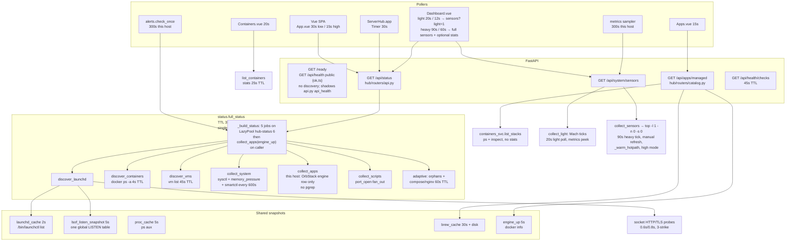
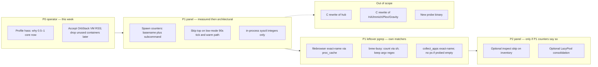

# Efficiency research: C rewrite vs panel wins

| Field | Value |
|---|---|
| **Author** | ServerHub systems research |
| **Date** | 2026-08-22 |
| **Status** | Draft |
| **Product version** | ServerHub 3.9.1 (`hub/__init__.py`) |
| **Host** | Apple M1 Pro, 10 cores, 32 GiB RAM (`sysctl hw.ncpu` / `hw.memsize`) |
| **Measurement window** | 2026-08-22T09:29:05Z – 2026-08-22T09:32:11Z (UTC) |
| **Later resample** | 2026-08-22T09:43Z (noise check; same bottleneck orders of magnitude) |
| **Scope** | Research + ranked recommendations. No product code, no C ports, no Docker/LaunchAgent reconfiguration. |

---

## Overview

This host’s efficiency problem is **not** the ServerHub panel, and it is **not** a missing C rewrite of Immich, Home Assistant, Plex, Gravity, or the panel itself.

Two read-only snapshots plus a 6-second resample show:

- **Home Assistant** (`hass`, PID 31264) pegging **0.5–1.0 core** (47–95% CPU) at **221–227 MiB** RSS.
- **OrbStack Helper `vmgr`** (PID 1291) holding **2273–2617 MiB** RSS and spiking **1.3% → 93%** CPU in the same minute.
- **ServerHub panel** (`app.py`, PID 37053) steady at **0.1% CPU, 67–68 MiB RSS**, 92 live threads (`ps -M`; pools are lazy, not 88 running workers), ~28 minutes of CPU time over 3 d 16 h (~0.5% of one core lifetime average).
- The truly expensive panel binaries (`brew services list --json` 1.14 s, `top -l 1 -n 0 -s 0` 0.76 s, `docker stats --no-stream` 2.07–2.12 s) are **TTL-cached and single-flighted**. **`docker stats` is skipped** on the low-mode dashboard 90 s tick. **`top` is not:** low mode skips it on the 20 s light poll and on the metrics sampler, but the 90 s heavy tick and `_warm_hotpath` still call `collect_sensors()` → `_cpu_and_mem_from_top_cached`. This install already uses `resource_mode: low`.

Rewriting selected Python in C/Rust would not move host load. The efficiency program (implementation order, matching the PR Plan) is: **measure HA and OrbStack first (operator, not panel code); then instrument spawn counters; then skip `top` on the low-mode heavy tick (the largest remaining panel spawn on this host); then integer sysctl.** Do not ship a native helper unless those counters later prove a remaining >100 ms/poll tax. The ROI table below ranks **impact**, not merge order.

A 09:43Z resample (reviewer noise check) still showed `hass` ~96–98% CPU / ~219–246 MiB, OrbStack `vmgr` ~13–29% / ~2.9–3.1 GiB, panel 0.1% CPU / ~102 MiB RSS / 92 threads, swap ~3.3/4.0 GiB. Same picture; panel RSS moved within tens of MiB.

---

## Background & Motivation

ServerHub is a FastAPI hub (`hub/`) plus Vue 3 UI (`web/` → `static/`) that discovers and drives LaunchAgents, Homebrew services, OrbStack/Docker, UTM VMs, and host sensors. The panel binds `127.0.0.1:8086` by default (`app.py`). This install is launched as `com.elvin.serverhub` and was listening on `*:8086` (PID 37053) during measurement.

The panel’s request path is subprocess-heavy by design: `launchctl`, `lsof`, `docker`, `brew`, `ps`, `pgrep`, `top`, `sysctl`, `utmctl`. Earlier work already collapsed the worst duplication:

- Shared `launchctl list` (`hub/launchd_cache.py`, 2 s TTL, comments cite ~40 ms).
- Shared `ps aux` (`hub/proc_cache.py`, 5 s TTL).
- One global `lsof -nP -iTCP -sTCP:LISTEN` (`hub/adaptive.py`, 5 s TTL; comments cite 61 ms vs 15×43 ms per-pid).
- Shared `brew services list --json` (`hub/brew_cache.py`, 30 s TTL + disk cache; comments cite 0.7–1.2 s, historically 8× per `/api/apps/managed`).
- Socket probes instead of extra `lsof` (`hub/util.py:port_open`, `hub/discovery/launchd.py` HTTP/TLS probes with 3-strike hysteresis).
- `resource_mode: low` stretches polls and **skips `docker stats` on the idle dashboard 90 s tick** (`web/src/views/Dashboard.vue` `refreshHeavy(..., highMode)`). The 20 s light poll uses `GET /api/system/sensors?light=1` → `collect_light` (no `top`). The 90 s heavy poll still loads full sensors (`loadSensors(forceSensors)` with default `light=false`), which `hub/routers/modules_api.py` documents on purpose: “the 90 s heavy tick and the manual refresh button keep that path.”

The remaining question is whether a C (or Rust) rewrite of “some services” would greatly improve efficiency, or whether cheaper panel/host moves dominate. This document answers from **this host’s live numbers** plus the current code.

**Pain points that remain (ranked by host impact, not code elegance):**

1. Third-party CPU: Home Assistant hot; OrbStack VM CPU spikes.
2. Third-party RSS: OrbStack VM ~2.3–3.1 GiB; Docker working set ~1.28 GiB; swap 3.3 / 4.0 GiB used.
3. Residual panel spawn tax, **this host, cold `/api/status`:** `memory_pressure -Q` every rebuild; 2–3 `sysctl -n` shells; `kern.boottime` text parse; occasional `sudo -n smartctl` (600 s); `utmctl`/`orbctl` behind a 45 s VM TTL; Launchd HTTP/TLS probes; one `lsof` + one `launchctl list` + one `docker ps`. **Not** on this host: `collect_apps` `pgrep` (see Findings §2). **Not skipped in low mode:** `top` on the 90 s dashboard heavy tick (~0.76 s, `_TOP_TTL` 60 s) and on `_warm_hotpath`.
4. 16 `LazyPool`s totaling **88 max workers**; **92 live threads** measured (`ps -M -p 37053`). Pools are created on first use. Idle cost, not the 12–15 load average.

---

## Goals & Non-Goals

### Goals

- Decide, with measurements, whether a C/Rust rewrite of any **in-scope** component would materially reduce CPU, RSS, or panel latency on this host.
- Produce a ranked ROI action list for overall host efficiency.
- Name bounded, reversible hub/web changes (files, functions, expected effect, risk) that are safe to implement next.
- Define how a later change would be verified (observability) and rolled out.

### Non-goals

- Implementing product code, C helpers, or rewrites in this pass.
- Rewriting Immich, Home Assistant, Plex, or Gravity in C (explicitly out of scope even if they dominate CPU).
- Stopping, restarting, or reconfiguring production Docker stacks, LaunchAgents, or `services.yaml`.
- Changing `data/` or committing.
- Tuning interactive desktop apps (Cursor, WindowServer, Terminal) except to subtract them from “server load”.
- A big-bang native panel or a new network listener.
- Turning `scripts[].adopted_from.process` into process-liveness probes. Today those rows are **port-liveness only** (`collect_scripts` → `port_open`). Changing that is a product change, not an efficiency cleanup.

---

## Live measurements

All commands were **read-only**. Nothing was killed, restarted, or reconfigured. Numbers are from this window; they are not a 24 h profile. HA and OrbStack are **spiky** — treat instantaneous `%CPU` as a range, RSS as more stable.

### Host

| Metric | Snapshot 1 `2026-08-22T09:29:05Z` | Snapshot 2 `2026-08-22T09:31:11Z` |
|---|---|---|
| Command | `uptime`; `sysctl -n hw.ncpu hw.memsize`; `memory_pressure -Q`; `vm_stat` | `uptime`; `sysctl vm.swapusage` |
| Load averages | 12.81 13.73 12.76 | 14.76 13.97 12.97 |
| Cores / RAM | 10 / 34 359 738 368 B (32 GiB) | same |
| `memory_pressure` free | 66% | not re-read |
| Swap | not measured | `total = 4096.00M used = 3324.44M free = 771.56M` |
| Compressor (snapshot 1 `vm_stat`) | 1 061 970 pages stored, 458 066 occupied; 60.8M swapins / 61.9M swapouts since boot | — |
| Uptime | 5 d 20 h 26 m | 5 d 20 h 28 m |

Load ~13–15 on 10 cores is **oversubscribed**. That is not the panel. Interactive noise in the same window included Cursor GPU/renderers, `WindowServer`, `corespotlightd`, `Terminal`, `VTEncoderXPCService`, `avconferenced`, and this research agent. Even after subtracting those, HA + OrbStack `vmgr` still account for most **server-side** CPU in the resample.

### Process / container CPU and RSS

RSS from `ps -axo rss` (KiB → MiB). `%CPU` is instantaneous unless noted.

| Process / container | PID / name | Snap 1 CPU | Snap 2 CPU | Resample CPU (3×2 s @ 09:32:05Z) | RSS | Notes |
|---|---|---|---|---|---|---|
| Home Assistant `hass` (Python 3.14) | 31264 | 93.3% / 94.7% | 93.9% | 73.3 → 82.7 → 47.7% | 221–227 MiB | LaunchAgent `com.homeassistant.core`. TIME 401:42 over 3 d 16 h ≈ **~7.5% of one core lifetime average**, currently hot. **Do not rewrite in C.** |
| OrbStack Helper `vmgr` | 1291 | 1.3% | 17.9% | 45.3 → 82.8 → 93.3% | 2273–2617 MiB | Linux VM. Spiky. Already C/native. |
| OrbStack.app | 1184 | 0.0% | 0.0% | — | ~76 MiB | UI |
| ServerHub panel `app.py` | 37053 | 0.1% | 0.1% | 0.1 / 0.1 / 0.1% | 67–68 MiB | Python 3.12. TIME 27:49 over 3 d 16 h ≈ **0.5% of one core lifetime**. 92 live threads (`ps -M`). |
| ServerHub.app menu bar | 3256 | 0.0% | 0.0% | — | ~34 MiB | Native Swift; polls `/api/status` every 30 s |
| Gravity API uvicorn `:18765` | 56701 | 0.1–0.2% | 0.2% | 0.1 → 0.2 → 0.2% | 136–144 MiB | Elapsed ~43 min, TIME 1:48 ≈ **~4% of one core since start**. **Do not rewrite in C.** |
| Gravity Next `next-server` | 24916 | 0.0% | 0.0% | — | ~69 MiB | |
| Gravity static_server `:3001` | 32209 | 0.0% | 0.0% | — | ~19 MiB | |
| Kidsmusic uvicorn `:8200` | 32261 | 0.1% | 0.1% | — | ~66 MiB | TIME 12:17 over 3 d 16 h — quiet |
| Immich native `immich` | 4298 | 0.0% | 0.0% | 0.0 / 0.0 / 0.0% | ~72 MiB | TIME 18:23 over 5 d 20 h. **Do not rewrite in C.** |
| `immich_server` (Docker) | container | 0.10% | — | — | 456 MiB / 4 GiB limit | healthy, 5 d up |
| `immich_redis` (Docker) | container | 1.78% | — | — | 13 MiB / 512 MiB | already C |
| `music-assistant` (Docker) | container | 0.05% | — | — | 441 MiB | |
| `teslamate` (Docker) | container | 0.09% | — | — | 214 MiB | |
| `miot_central` (Docker) | container | 4.94% | — | — | 96 MiB | Xiaomi; largest **container** CPU in `docker stats --no-stream` |
| `xiaomihub_luci_shim` / `ot_host` | containers | 0.04 / 0.08% | — | — | 32 / 20 MiB | `xiaomihub_miio_lan` and `xiaomihub_mdns` were **Exited (137)** ~10 min before snap 1 — observed only, not acted on |
| Plex Media Server | 1933 | 0.0% | 0.0% | 0.0 / 0.0 / 0.1% | ~45 MiB | **Do not rewrite in C.** Plugins extra ~19 MiB |
| HA Matter Hub (node) | 5939 | 0.0% | 0.0% | — | ~117–119 MiB | |
| ESPHome device builder | 71682 | 0.1–0.3% | 0.3% | — | ~32 MiB | |
| nginx master+workers | 1176 + workers | 0.0% | 0.0% | — | ~16 MiB combined | already C |
| redis-server `:6380` | 1173 | 0.0–0.1% | 0.0% | — | ~3.6 MiB | already C; TIME 12:00 over 5 d 20 h |
| postgres@17 + @18 (all procs) | several | ~0% | — | — | **~116 MiB sum** (`n=23`) | already C |
| ollama serve | 66930 | 0.0% | 0.0% | — | ~22 MiB | idle |
| Sunshine | 1139 | 0.0% | — | — | ~26 MiB | |
| cloudflared (2 tunnels) | 56562, 89329 | 0.0% | — | — | ~29 + 31 MiB | already Go/C |
| wireguard-go | 379 | 0.2% | — | — | ~8 MiB | already Go |
| Docker working set (sum of `docker stats` MemUsage) | 7 running | — | — | — | **~1281 MiB** | command: `docker stats --no-stream` @ 09:32Z |

**Panel vs the rest (this window):** panel CPU is **~100–900× smaller** than HA or a hot OrbStack `vmgr` sample. Panel RSS is ~3% of OrbStack VM RSS and ~5% of the Docker working set.

### Launchd (read-only)

Command: `launchctl list` @ 09:29:05Z.

| Item | Value |
|---|---|
| Lines (jobs in the user session) | 571 |
| Running (numeric PID) | 284 |
| `~/Library/LaunchAgents/*.plist` | 60 |
| Panel job | PID 37053, label `com.elvin.serverhub` (last status column `-15`) |
| Related labels seen | `com.homeassistant.core` running; `com.homeassistant.matter-hub` running; Gravity web/api/edge/next/autocontinue; `application.com.plexapp.plexmediaserver.*`; `local.system-nginx`; `local.esphome`; Immich backup/keepalive/logrotate **loaded but not running** (PID `-`); `local.serverhub.watchdog` loaded not running |

`/bin/launchctl list` wall time: **0.01 s** (`/usr/bin/time -p`, 09:29:55Z). Rewriting the listing in C is pointless.

### Panel subprocess timings (same binary / comparable flags)

Timed @ **2026-08-22T09:29:55Z** (docker inspect/stats follow-up @ 09:32:05Z) with `/usr/bin/time -p`, **one invocation each**, not a load test of the combined request.

These are **not** always the exact hub argv. Call-site argv is in the “Hub argv” column. Wall times are the right order; comments in `brew_cache.py`, `adaptive.py`, `containers_svc.py`, `docker_cli.py`, `metrics.py` match this host.

| Timed command | Hub argv (call site) | real | Where used | Current mitigation |
|---|---|---|---|---|
| `/bin/launchctl list` | same | 0.01 s | `hub/launchd_cache.py` `_listing` | 2 s TTL, single-flight |
| `/usr/sbin/lsof -nP -iTCP -sTCP:LISTEN` | same | 0.06 s | `hub/adaptive.py` `lsof_listen_snapshot` | 5 s TTL; 204 listener lines this host |
| `/bin/ps aux` | same | 0.07 s | `hub/proc_cache.py` | 5 s TTL |
| `docker ps -a` (discovery format) | `docker ps -a --format '{{.Names}}\t…'` | 0.06–0.10 s | `hub/discovery/containers.py`; list path also in `hub/containers_svc.py` | 4 s / 22 s TTLs + single-flight |
| `docker inspect $(docker ps -a --format '{{.Names}}')` | `docker inspect *names` | 0.04 s | `hub/containers_svc.py` `_build_container_list` | always on list path; 9 objects here |
| `docker stats --no-stream` (all) | `docker stats --no-stream --format '…' *running_names` | **2.07–2.12 s** | `hub/containers_svc.py` `_fetch_stats` | 25 s TTL; **skipped** on dashboard low-mode 90 s tick (`withDockerStats=false`); Containers page still polls 20 s |
| `/usr/bin/top -l 1` | **`/usr/bin/top -l 1 -n 0 -s 0`** (`hub/sensors_svc.py` `_cpu_and_mem_from_top`) | **0.76 s** | `_cpu_and_mem_from_top_cached` | 60 s TTL low / 20 s high; **not** used by `collect_light` or metrics in low mode; **is** used by 90 s heavy tick and `_warm_hotpath` |
| `/opt/homebrew/bin/brew services list --json` | same | **1.14 s** | `hub/brew_cache.py` | 30 s TTL > inventory 22 s; disk cache; `invalidate_brew_services()` on mutate |
| `/usr/bin/pgrep -x Python` | **sample only** — this host’s `apps:` list does not pgrep anything (see Findings §2) | 0.02 s | `hub/discovery/apps.py` `_probe_app` when `apps[].process` is set | **zero** such entries on this install |
| `sysctl -n hw.ncpu hw.memsize kern.boottime` (one process, three keys) | **three separate** `sysctl -n` calls (`hw.ncpu`, `hw.memsize`, plus `hw.pagesize` or `kern.boottime`) | 0.00 s | `hub/system.py`, `hub/sensors_svc.py`, `hub/metrics.py` | sensors static cache 300 s (`_STATIC_TTL`); metrics `_ncpu` cache **600 s** (`_NCPU_TTL`); `collect_system` still shells every status rebuild |
| `memory_pressure -Q` | same | 0.00 s | sensors / `collect_system` / metrics | cheap; **every** status rebuild via `collect_system` |

Code comments that **match this host** (not invented): brew 0.7–1.2 s / 1.25 s; `top` 0.85–1.6 s; `lsof` 61 ms; per-pid `lsof` 43 ms; `docker stats` ~2 s; `docker ps` ~470 ms historically (this window 60–100 ms); `docker info` 160 ms–1.1 s (`hub/docker_cli.py` `_ENGINE_TTL = 5.0`).

### Panel HTTP (already running, no config change)

@ 09:29:55Z, `curl` to `127.0.0.1:8086`:

| Endpoint | HTTP | `time_total` | Body |
|---|---|---|---|
| `GET /ready` | 200 | 0.011 s | `{"ok":true,"version":"3.9.1"}` |
| `GET /api/health` | 200 | 0.005 s | `{"ok":true,"ts":1787390995}` — **public** handler in `hub/app_factory.py` (`public_liveness`). No `version`. The `hub/routers/api.py:api_health` handler (version + cached counts) is registered later on the `require_auth` router and is **shadowed**; it is not what serves this path. |
| `GET /api/status` | 401 | 0.011 s | `auth.login_required` — **authenticated full status not timed**. Cold `full_status` cost is inferred from subprocess timings + code, not from a live 200. |

Listener: `Python 37053 … TCP *:8086 (LISTEN)`.

### This install’s panel settings (read `services.yaml`, not modified)

| Setting | Value | Default in code |
|---|---|---|
| `settings.resource_mode` | `low` | `low` (`hub/resource_mode.py`) |
| `settings.metrics_interval` | 300 s | 90 s (`hub/app_factory.py` lifespan) |
| `settings.alert_interval` | 300 s | 90 s |

`apps:` contains **only** OrbStack (`id: orbstack`, `container_engine: true`). `Plex Media Server`, `immich-ml-native`, and `cockpit-tools` are `scripts[].adopted_from.process` metadata. `collect_apps` therefore never reaches `_probe_app` / `pgrep` on this host. `collect_scripts` probes **ports** only.

Low mode: sidebar 30 s under a 35 s status TTL; dashboard light sensors 20 s (`light=1`); dashboard heavy 90 s **without docker stats, with full sensors/`top`**.

---

## Current panel data flow



Hot functions (absolute paths):

| Path | Role |
|---|---|
| `/Users/a0000/Services/serverhub/hub/routers/api.py` `api_status` / `_visible_status` | Authenticated status; `?force=` rebuild is **admin-only** |
| `/Users/a0000/Services/serverhub/hub/app_factory.py` `public_liveness` | **Wins** `GET /api/health` (`{ok, ts}` only). `api.py:api_health` is shadowed. |
| `/Users/a0000/Services/serverhub/hub/status.py` `full_status`, `_build_status`, `_adaptive_info` | 35 s/20 s TTL, single-flight. `_build_status` submits **five** pool jobs then `collect_apps(engine_up)` on the caller (needs container `engine_up`). Do not fan `collect_apps` onto the same pool without that dependency. `_pool = LazyPool(6, "hub-status")` is the cap, not the job count. |
| `/Users/a0000/Services/serverhub/hub/discovery/launchd.py` `discover_launchd` | Plist parse + shared listing + `ports_for_pid` + HTTP probes |
| `/Users/a0000/Services/serverhub/hub/discovery/apps.py` `_probe_app` / `collect_apps` | `pgrep -x` **only** for yaml `apps[].process`. This host: OrbStack `container_engine` only → **zero pgrep**. |
| `/Users/a0000/Services/serverhub/hub/discovery/apps.py` `collect_scripts` | `port_open` only. `adopted_from.process` is not consulted. |
| `/Users/a0000/Services/serverhub/hub/discovery/containers.py` `discover_containers` | `docker ps -a`, 4 s TTL, timeout tolerance 3 |
| `/Users/a0000/Services/serverhub/hub/adaptive.py` `lsof_listen_snapshot`, `guess_http_url` | Batched lsof; non-HTTP ports remembered 30 min |
| `/Users/a0000/Services/serverhub/hub/apps_manage_svc.py` `inventory` | 22 s TTL; docker/native/launchd/vms/engine/host fan-out |
| `/Users/a0000/Services/serverhub/hub/containers_svc.py` `_build_container_list`, `_fetch_stats` | inspect always; stats ~2 s |
| `/Users/a0000/Services/serverhub/hub/sensors_svc.py` `collect_light` / `collect_sensors` | Mach `host_statistics` already via ctypes; `top` on full collect |
| `/Users/a0000/Services/serverhub/hub/routers/modules_api.py` `sensors` | `light=1` → `collect_light` unless `force` or high mode |
| `/Users/a0000/Services/serverhub/hub/alerts.py` `check_once` | Reuses `full_status` (this host every 300 s) |
| `/Users/a0000/Services/serverhub/web/src/App.vue` `statusPollMs` | 30 s low / 15 s high, visibility-aware (`web/src/lib/poll.js`) |
| `/Users/a0000/Services/serverhub/web/src/views/Dashboard.vue` `tickAdminLight` / `refreshHeavy` | Light: `loadSensors(false, { light: !highMode.value })`. Heavy: `getContainers(withDockerStats)` + `loadSensors(forceSensors)` **without** `light`. |
| `/Users/a0000/Services/serverhub/macos/ServerHubLauncher.swift` | 30 s `Timer` → `GET api/status` |

Scheduling / wake-ups (panel):

- Lifespan (`hub/app_factory.py`): metrics sampler, alerter, scheduler, SMART scheduler, stack-backup recovery thread, `_warm_hotpath` (brew, **`collect_sensors()` not `collect_light()`**, host snapshot, VMs, `full_status`, `inventory`), optional updates warmer (high mode only), alias autobind.
- UI polls pause when the tab is hidden (`startVisibleInterval`).
- Menu bar does **not** pause (30 s always). That is fine: it hits the 35 s status cache.

---

## Findings

### 1. The panel is not the host bottleneck

PID 37053 stayed at **0.1% CPU** across five samples. Lifetime CPU ~28 min in 3.7 days. RSS 67–68 MiB in the primary window (~102 MiB at 09:43Z). `/ready` and public `/api/health` answer in 5–11 ms. A C rewrite of the hub would, at best, shave a fraction of one core-percent and some of ~70–100 MiB — invisible next to HA and OrbStack.

The hub is **I/O-bound** (subprocess + sockets), not compute-bound. Python is waiting on `docker stats`, `brew`, `top`, `lsof`, TCP connects — binaries that are **already C**. Replacing the waiter with another waiter does not help.

### 2. Hot panel paths are already mostly cached; leftovers are small — and pgrep is not one of them **here**

Already done (keep):

- Single-flight TTLs on status, inventory, containers, brew, launchd, ps, lsof, engine_up, VMs.
- One `lsof` snapshot instead of per-pid.
- Socket probes + `_NON_HTTP_PORTS` + `_not_http` TTL (Redis :6380 lesson in `adaptive.py`).
- HTTP 3-strike hysteresis so a CPU storm does not flap LaunchAgent rows (`discovery/launchd.py`, alerts.jsonl 2026-08-18).
- `collect_light` / metrics peek so the 300 s sampler does not spawn `top`.
- Dashboard low mode skips docker stats on the 90 s tick.
- `_warm_hotpath` so the first visitor after kickstart is not a 1.2 s + 1.6 s + 0.3 s pile-up — **but it still pays `top` via `collect_sensors()`**.

Still on the cold `/api/status` path **on this host**:

- `collect_system`: `memory_pressure -Q` every rebuild (0.00 s here; still a fork); two `sysctl -n` for ncpu/memsize; `sysctl -n kern.boottime` parsed as **text** (`"sec ="`); `sudo -n smartctl -a /dev/disk0` every 600 s.
- `discover_vms`: `utmctl` / `orbctl` behind `_LIST_TTL = 45 s` (longer than status TTL on purpose; comments cite ~390 ms if it missed every refresh).
- Launchd HTTP/TLS probes (fanned out, 0.6 s timeout). Necessary for “HTTP not answering”; already bounded.
- One `lsof`, one `launchctl list`, one `docker ps`.

**Not** on this host’s `/api/status`:

- `collect_apps` → `pgrep -x`. `services.yaml` `apps:` is only OrbStack (`container_engine: true`). The engine branch never calls `pgrep`. `Plex Media Server` / `immich-ml-native` / `cockpit-tools` live under `scripts:` as `adopted_from.process`. `collect_scripts` is port-liveness. Tests still stub `pgrep` because the code path exists for other installs. A `proc_cache` rewrite that **always** calls `ps_pid_commands()` when `probed` is empty would **add** ~70 ms `ps aux` to every status miss for no gain. **Do not invoke `ps` when there are no process apps.**

Still on `/api/apps/managed` / Containers:

- `_build_container_list` always `docker inspect`s every name. **0.04 s** on this host with 9 objects — not a host-level win; a latency nit if the container count grows.
- `docker stats --no-stream` **2.1 s** if the Containers page is open (20 s poll, 25 s TTL → hit). Dashboard low mode already avoids it.

Largest remaining **panel** spawn on this host with a sitting dashboard: **`top` (~0.76 s) about once a minute** (90 s heavy tick vs 60 s `_TOP_TTL`). That beats unused `pgrep` cleanup on measured ROI.

### 3. Third-party services dominate

| Would a C rewrite help? | Service | Why |
|---|---|---|
| **No — forbidden and wrong tool** | Home Assistant | 0.5–1 core **now**, ~7.5% core lifetime. Python event loop / integrations / recorder / cameras. Rewrite is a multi-year fork. Tune integrations, recorder, and debug the current hotspot. |
| **No — already native** | OrbStack `vmgr` | 2.3–3.1 GiB RSS, CPU spikes to a full core. This **is** the Linux VM. Fewer/lighter containers, not a rewrite. |
| **No — forbidden** | Immich | Native worker ~72 MiB / 0% CPU; `immich_server` 456 MiB / 0.10%; redis already C. ML/thumbnails are the cost when busy; not observed as hot in this window. |
| **No — forbidden** | Plex | 45 MiB / 0% in this window. I/O and transcode when in use; transcode is already native. |
| **No — forbidden** | Gravity | API 136–144 MiB, ~4% core since last start; Next 69 MiB idle; static server 19 MiB. Web/API I/O, not a C inner loop. Sibling Gravity page-perf work is the right layer. |
| **No** | nginx, redis, postgres, cloudflared, wireguard-go, ollama (idle) | Already C/Go/native and quiet. |
| **No** | ServerHub panel | 0.1% CPU, subprocess-bound. |
| **No** | ServerHub menu bar | Already Swift. 0% CPU, 34 MiB. |
| **Operator tune, not C** | `miot_central` 4.94% / 96 MiB | Largest Docker CPU sample. Xiaomi hub; leave running; profile only if it stays elevated. |
| **Operator tune, not C** | music-assistant 441 MiB, teslamate 214 MiB | RSS, not CPU. Do not stop stacks in this program. |

### 4. Candidates for a *tiny* native helper (and why not now)

A `hub-probe` binary that printed JSON for (process table + TCP listen table) could replace `ps` + `lsof` + some `pgrep` (~70 + 60 + N×20 ms cold).

That is **not** justified:

- Those commands are already cached inside one status refresh.
- Measured cost is **tens of milliseconds**, not cores. `top` at 0.76 s is the panel spawn that matters, and it is already C — the win is **not calling it**.
- `sensors_svc.py` already talks to Mach via ctypes (`host_statistics`). The same pattern can read **integer** `sysctl` names without a new binary.
- A new helper is a new artifact to sign, ship, and not make setuid. Attack surface for a 60 ms win.

**If** spawn counters after the Python cleanups still show >100 ms/poll in `sh()`/`run_capped()` for ps/lsof, **then** consider ctypes/`libproc` in-process, not a standalone C daemon.

---

## Proposed design (efficiency program)

Ordered by **host-level ROI**, then **measured panel spawn**, not by how interesting a rewrite would be.



### ROI ranking (effort vs expected host-level win)

| Rank | Action | Effort | Expected host-level win | Expected panel win |
|---|---|---|---|---|
| 1 | Profile / tune Home Assistant | Operator, not this repo | 0.5–1 core in this window | n/a |
| 2 | Live with OrbStack VM RSS; later drop unused stacks under change control | Operator | GiB RSS / swap; CPU spikes | n/a |
| 3 | Skip `top` on low-mode 90 s heavy tick + `_warm_hotpath` | S (Dashboard.vue + `_warm_hotpath`) | ~0 cores (0.76 s once/min while dashboard is open) | Largest remaining panel spawn **on this host** |
| 4 | Spawn + latency counters (`sh` + `run_capped`, keyed basename+subcommand) | S | 0 | Makes later PRs falsifiable |
| 5 | ctypes `sysctlbyname` for **integer** hw keys | S | 0 | Fewer forks under load 13; ~0 s wall today |
| 6 | `collect_apps` exact-name helper; **do not call `ps` if `probed` is empty** | S | **0 on this host** (zero process apps) | Architectural; keeps tests for option-shaped names |
| 7 | filebrowser `pgrep -x` → exact-name helper; brew-busy stays regex, route through `sh()` so counters see it | S | 0 | Files page / brew-miss path |
| 8 | Defer `docker inspect` on inventory list | M | 0 | 40 ms today; counters-gated |
| 9 | C rewrite of hub / HA / Immich / Plex / Gravity / `hub-probe` | XL | 0 | Reject |

### Phase 0 — operator / host (no ServerHub code)

**Home Assistant (highest expected host win).**  
`hass` was 47–95% CPU for the entire measurement window. Lifetime average is only ~7.5% of a core, so this is a **hot period**, not “HA always uses a core”. Next steps (outside this repo, do not stop HA from the panel as part of this research):

- HA **Profiler** / `py-spy` / `top` inside the venv during a 90% spell.
- Check recorder commit interval, camera/stream integrations, bluetooth/Xiaomi polling, log spam.
- Python 3.14 in `/opt/homebrew/Cellar/python@3.14/.../hass` is unusual; if the hotspot is a 3.14 regression, that is an HA-side pin, not a C port.

**OrbStack.**  
~2.5–3.1 GiB RSS is the VM, not a leak in ServerHub. CPU spikes coincided with our `docker stats`/`inspect` and other Docker traffic; some of that is measurement, some is real VM steal. Do not rewrite. Later (separate change control): fewer stacks, memory limits already present on immich_server (4 GiB) and immich_redis (512 MiB).

**Swap 3.3 / 4.0 GiB.**  
32 GiB RAM with 66% “free” plus a large compressor and 3.3 GiB swap is consistent with a 2.5 GiB VM + 1.3 GiB containers + desktop. Reducing OrbStack/HA load helps swap more than rewriting Python.

**Keep current panel YAML.**  
`resource_mode: low`, 300 s metrics/alerts is already quieter than shipped defaults (90 s). Do not flip to `high` on this host.

### Phase 1 — panel (justified)

These do **not** reduce the 12–15 load average. They reduce spawn noise.

1. **Instrumentation first** — counters that can actually prove the budget (see API / spawn-counter design).
2. **Skip `top` on the low-mode 90 s heavy tick and on `_warm_hotpath`.** Manual refresh and high mode keep `collect_sensors`. This is Alternative D; adopt it. Larger measured spawn than unused `pgrep` on this host.
3. **In-process `sysctl` for integer keys only** (`hw.ncpu`, `hw.memsize`, `hw.pagesize`). Leave `kern.boottime` on `sh()` until a follow-up unpacks `struct timeval`. Do not feed binary boottime into the `"sec ="` parser.

Then leftover `pgrep` **with distinct matchers** (not a shared substring helper):

4. Exact-name helper on `proc_cache` (`basename(argv0)` with argv0 cut at ` -` or ` /`) for collect_apps + filebrowser. **No `ps` when `probed` is empty.**
5. `_brew_busy` keeps argv regex (`test_brew_cache_invalidation.py`); route the spawn through `sh()`/`run_capped` so PR 1 can see it.

### Phase 2 — panel (only with numbers)

- Split `docker inspect` off the inventory list if spawn counters show it; **not** worth it at 40 ms / 9 containers today.
- Collapse `LazyPool`s only if RSS/thread dumps show real cost. 92 live threads at ~70–100 MiB RSS is not an emergency.
- ctypes/`libproc` listen table **instead of** `lsof` only if counters show lsof still on the hot path after TTL hits.

### Explicit non-design

No C hub. No C HA/Immich/Plex/Gravity. No setuid helper. No extra listen port. No change to `data/` or `services.yaml` in this program’s first PRs. No `settings.apps_use_proc_cache` flag. No treating `adopted_from.process` as process-liveness.

---

## API / interface changes

None required for the `top`-skip PR (query `light=` already exists).

### Spawn counters (PR 1) — in-memory structure

Not hardware atomics. A `threading.Lock` (or GIL-protected ints) is enough.

```
window_s      = 60
started_mono  = time.monotonic()   # tumbling window: reset when peek sees age >= window_s
total         = int
overflow      = int                # increments when a new key would exceed cap
by_key        = dict[str, int]     # cardinality cap 64
```

**Keying (no full argv):**

- Default: executable basename (`lsof`, `ps`, `pgrep`, `top`, `sysctl`, `memory_pressure`, `utmctl`, `orbctl`, `smartctl`, …).
- **`docker` / `brew` / `launchctl`:** `"{basename} {first_subcommand}"` so `docker ps`, `docker inspect`, `docker stats`, `docker info`, `brew services`, `launchctl list` are distinct. First subcommand only; never the rest of argv (tokens, paths).
- Unknown / empty subcommand: basename only.

**What increments the counter:**

- `hub.util.sh`
- `hub.util.run_capped`
- **Not** (until routed): `hub/brew_cache.py` `_brew_busy` `subprocess.run(["/usr/bin/pgrep", …])`. Document that gap; PR 5 routes it through `sh()`.

**Test isolation:** `spawn_counts.reset()` in `setUp`/`tearDown`. Tests must not leak a process-global dict across cases. Cardinality cap is tested with >64 distinct keys → `overflow` increments, `by_key` stays ≤64.

**Reachable surface (public `/api/health` stays `{ok, ts}`):**

- **`GET /api/debug/spawns`** on the existing `require_auth` router, **admin-only** (`auth.is_admin`). JSON: `{window_s, age_s, total, overflow, by_key}`.
- Optional: one INFO line to stderr at most once per window (basename keys only).
- Optional: `X-ServerHub-Status-Age` on `GET /api/status` = `time.time() - _status_cache["t"]` seconds (or empty if never built). Body `"ts": strftime_now("%H:%M:%S")` is a **clock stamp**, not unix seconds and **not** cache age — it does not substitute for the header.

Do **not** put `spawns` on `hub/routers/api.py:api_health` (shadowed) or on `public_liveness`.

No public API break. Menu bar continues to call `GET /api/status` every 30 s (cache hit).

---

## Data model changes

None. No YAML schema, no JSONL metrics field required for Phase 1.

Spawn counters stay **in memory** (process lifetime), not a new `data/*.jsonl` (SSD policy in `hub/metrics.py` is already “batch, don’t chatter”).

---

## Bounded hub/web changes (safe next)

Each item is independently reviewable. None require Docker/LaunchAgent changes.

| # | Change | Files / functions | Expected effect | Risk |
|---|---|---|---|---|
| 1 | **Spawn + latency counters** | `hub/util.py` `sh()`, `run_capped()`; `hub/routers/` new `GET /api/debug/spawns` admin-only; tests that `reset()` isolation | Makes “did we actually reduce subprocesses?” measurable. Key = basename + first subcommand for docker/brew/launchctl. | **Low.** Do not log argv. Cap 64 keys. `_brew_busy` invisible until item 5. |
| 2 | **Skip `top` on low-mode heavy tick and warm path** | `web/src/views/Dashboard.vue` `refreshHeavy`: `loadSensors(forceSensors, { light: !highMode.value && !forceSensors })`; `hub/app_factory.py` `_warm_hotpath`: `collect_light()` (or `collect_sensors` that omits `top` unless high); `hub/routers/modules_api.py` comment; Dashboard tests | Stops the ~0.76 s `top` once/min on a sitting low-mode dashboard and at every LaunchAgent start. After this PR, low-mode Top CPU / PhysMem extras update **only** on manual Refresh (`forceSensors=true`) or high mode — **not** on the 90 s tick. | **Low.** `loadSensors` already merges `top_processes` across light ticks, so the table keeps the last full extras until Refresh/high. Warm path will not pre-fill extras. |
| 3 | **In-process sysctl — integers only** | Tiny helper used by `hub/sensors_svc.py` `_static_hw`, `hub/system.py` `collect_system` ncpu/memsize, `hub/metrics.py` `_ncpu` | Drops 2–3 `/usr/sbin/sysctl` **integer** forks per sensors/status/metrics tick. Wall time today ~0 s; fewer forks under load 13. | **Low.** Call `sysctlbyname` with a **`ctypes.c_uint64` buffer** (or size-probe then read); `hw.memsize` is 64-bit, `hw.ncpu`/`hw.pagesize` are smaller. Treat `rc != 0`, short `oldlen`, or a zero `hw.memsize` as failure and fall back to `sh(["/usr/sbin/sysctl", "-n", name])` — a too-short buffer can return `rc == 0` with a truncated RAM total. **Leave `kern.boottime` on `sh()`** until a follow-up unpacks `struct timeval` (`tv_sec`, `tv_usec`). Do not parse binary output with `"sec ="`. Keep caller TTLs: sensors `_STATIC_TTL` **300 s**, metrics `_NCPU_TTL` **600 s** — helper is a read, not a unified cache. |
| 4 | **`collect_apps` exact-name helper; no `ps` if empty** | `hub/discovery/apps.py` `_probe_app`; new `proc_cache` exact-name function (not `process_matches`); tests `tests/test_fanned_out_probes.py`, `tests/test_security_regressions.py` | **Zero spawn change on this host.** Architectural cleanup for installs that have `apps[].process`. | **Low if specified.** See matcher spec below. **Must not** call `ps_pid_commands()` when `probed` is empty. Must not use `process_matches` (case-insensitive substring). Keep `cli_args.is_safe_positional`. **Must not** start probing `scripts[].adopted_from.process`. |
| 5 | **filebrowser exact-name; brew-busy stays regex, counted** | `hub/files_svc.py` `pgrep -x filebrowser-bin` → exact-name helper; `hub/brew_cache.py` `_brew_busy` keep `_brew_argv_patterns()`, call `sh(["/usr/bin/pgrep", "-f", pattern], …)` (or `run_capped`) instead of raw `subprocess.run`; `tests/test_brew_cache_invalidation.py`; `tests/test_files_logs_tools_leftover_500s.py` | One less spawn class on Files; brew-busy becomes visible to counters. | **Low.** Do **not** share the exact-name helper with brew-busy. `launcher_svc` **keeps** `pgrep -u … -f -x` for exact argv of ServerHub.app. |
| 6 | **Do not `docker inspect` on inventory list** | `hub/containers_svc.py` `_build_container_list`; `list_stacks` already `with_stats=False` | Avoid inspect when Apps page only needs name/state/project. **40 ms** on this host — defer unless counters show growth. | **Medium.** Inspect fills ip/mounts/restart_policy. Detail drawer must still inspect. Easy to regress the Containers page. **Not in the first merge.** |
| 7 | **Menu bar peek** | `macos/ServerHubLauncher.swift` | Could shrink payload. **Saves almost nothing** (30 s poll vs 35 s TTL = cache hit). Skip unless Swift wants a smaller payload. | **Low/none.** Not worth a PR until status JSON is proven large. |
| 8 | **C helper / ctypes libproc** | n/a | Replaces 60–70 ms `lsof`+`ps`. | **Do not implement** until item 1 shows those commands still dominate after 2–5. **No setuid, no extra listener.** |

### Exact-name matcher (replaces `pgrep -x`, not `process_matches`)

`proc_cache.process_matches` is a **case-insensitive substring** over `ps aux` lines (skips lines containing `"ps aux"`). `native_catalog` uses that as “contains”. Copying it into `_probe_app` would change “running?” for any argv that merely *mentions* the needle.

`ps_pid_commands()` COMMAND is the **full argv** (`split(None, 10)[10]`), not `comm`. Live Plex argv is `/Applications/Plex Media Server.app/Contents/MacOS/Plex Media Server`. Tokenizing on spaces yields `/Applications/Plex`. Exact `COMMAND == "Plex Media Server"` misses.

**Specified matcher** (new helper, e.g. `proc_cache.comm_equals(name)`):

1. If `probed` / requested names is empty → return immediately, **do not** call `ps_lines()`.
2. Read `ps_pid_commands()` (existing 5 s `ps aux` snapshot). Do **not** add a second `ps -axo pid,comm` spawn unless a later PR proves `aux` argv0 is insufficient.
3. For each COMMAND string, extract argv0:
   - If COMMAND starts with `/`: take the prefix up to the first ` -` (space + ASCII hyphen, start of flags) **or** the first ` /` (space + new absolute path), whichever comes first; else the whole string. **Do not** tokenize on every space — that would split `Plex Media Server.app`. Verified: `/usr/bin/vim /opt/homebrew/bin/brew` has no ` -`, so a ` -`-only rule makes `basename` = `brew` (false `pgrep -x brew` hit). Cutting at ` /` yields argv0 `/usr/bin/vim`.
   - If COMMAND does **not** start with `/` (relative `vim …`, some kernel/user rows): argv0 is the **first whitespace-separated token only**.
4. Compare `os.path.basename(argv0) == name` (case-sensitive, like default `pgrep -x`).
5. Fixtures that must **hit**: `Plex Media Server` (spaces in path, no ` /` argument); `immich-ml-native`; `/usr/local/bin/filebrowser-bin` vs `filebrowser-bin`; `/usr/bin/python3 -m uvicorn` vs `python3`.
6. Fixtures that must **miss** (today’s `pgrep -x` also misses): `vim /opt/homebrew/bin/brew` and `/usr/bin/vim /opt/homebrew/bin/brew` vs name `brew`; `vim /Users/a0000/Services/filebrowser/filebrowser-bin` vs `filebrowser-bin`. Brew-busy continues to use `_brew_argv_patterns()` / `sh()`, not this helper.

`cli_args.is_safe_positional` stays on yaml `process` before any match.

**Research-only (no code in this program):** HA profiler, OrbStack memory, Xiaomi `miot_central` CPU, Gravity API 4% since restart, exited `xiaomihub_*` 137s.

**Web:** no poll-interval change. Low mode stays. Item 2 only changes **what** the 90 s tick asks for (`light=true`), not how often.

---

## Key decisions

1. **Do not rewrite ServerHub in C or Rust.**  
   Measured 0.1% CPU / ~70–100 MiB. The remaining work is spawn elimination, which Python already does with `ttl_memo` / `cached_snapshot`.

2. **Do not rewrite Immich, Home Assistant, Plex, or Gravity in C.**  
   Forbidden by scope; also the wrong tool (I/O, ecosystems, already-native pieces). HA is the CPU story; the fix is HA config/profiler, not a language change.

3. **Do not ship a native probe binary in the next PRs.**  
   `lsof` 60 ms and `ps` 70 ms are cached. ctypes is the incremental path if needed (`sensors_svc` already uses Mach). A helper would need a trust story and must not be setuid.

4. **Prefer “one subprocess, many readers” over faster subprocesses.**  
   The 2026 work in `launchd_cache`, `proc_cache`, `brew_cache`, `adaptive.lsof_listen_snapshot`, `engine_up` TTL is the correct architecture. Finish leftovers with **the right matcher**, and **do not add `ps` on installs with no process apps**.

5. **Keep `resource_mode: low` and 300 s metrics/alerts on this host.**  
   Already quieter than defaults. High mode would add 12 s full sensors and docker stats every 60 s on a machine whose load is already 13. Low mode today still runs `top` on the 90 s heavy tick; **that skip is in scope** (decision 11) and is not a mode change.

6. **Instrument before optimizing Phase 2.**  
   Historical comments (1.2 s brew, 1.6 s top, 644 ms per-pid lsof) were true; several are already fixed. New work needs `sh()`/`run_capped()` counters so we do not re-fix myths.

7. **Host ROI ≠ panel ROI.**  
   Panel PRs are for maintainability and tail latency under load. Host ROI is HA + OrbStack. Do not sell panel PRs as “will drop load from 14 to 4”.

8. **No extra network listeners, no setuid, no `services.yaml` edits in the implementation PRs.**  
   Matches this research’s constraints and the panel’s bind/auth model.

9. **Spawn-counter keying:** basename plus first subcommand for `docker` / `brew` / `launchctl`; basename only otherwise; count `sh` and `run_capped`; 60 s tumbling window; 64-key cap; lock/GIL ints; admin `GET /api/debug/spawns`. Public `/api/health` unchanged.

10. **Process-name matching for `pgrep -x` replacements:** `basename(argv0)` where argv0 ends at the first ` -` **or** ` /` (space + absolute path) when COMMAND starts with `/`, else the first whitespace token. **Never** `process_matches` substring. Brew-busy keeps argv regex. `launcher_svc` keeps `pgrep -u -f -x`. Empty process-app list → no `ps`.

11. **Low-mode `top` on the 90 s heavy tick is a bug in the “quiet profile” story, not a feature we keep.** Skip it (and warm-path `top`) in Phase 1. Keep `top` for high mode and manual refresh.

12. **No `settings.apps_use_proc_cache` flag.** Tests cover option-shaped names and the exact-name fixtures. A flag would bit-rot on this host where the path is already idle.

---

## Alternatives considered

### A. Rewrite selected Python in C or Rust

**What:** Port `full_status` / discovery / the whole hub, or write `hub-probe` in C.

**Pros:** Lower per-spawn overhead; possible RSS drop from ~70 MiB toward a few MiB; marketing “native”.

**Cons:** Months of work; every `hub/` hardening test (leftover inf, `\\ud800`, sudoers, fan-out isolation) would be rewritten; still blocked on `docker stats` (2.1 s) and `brew` (1.14 s) which stay out of process; **0.1% CPU today** so the win is not on the host; Immich/HA/Plex/Gravity still dwarf it.

**Verdict:** Reject as a strategy. Revisit a **tiny** in-process ctypes reader only after counters.

### B. Keep Python; remove remaining subprocess/polling waste

**What:** Finish the cache/single-flight program; exact-name `pgrep` leftovers; in-process sysctl integers; spawn metrics; leave TTLs aligned with UI polls.

**Pros:** Matches existing architecture; small PRs; tests already exist for pgrep safety and fan-out; no new attack surface; latency under load 13 (forks are expensive when the machine is already hot).

**Cons:** Will not fix HA 90% or OrbStack 2.5 GiB; easy to over-claim; `collect_apps` cleanup is **idle on this host**.

**Verdict:** **Adopt** for panel work, with skip-`top` ranked above unused `pgrep`.

### C. Do nothing to the panel; only tune third-party services

**What:** Profile HA; leave ServerHub as-is; maybe drop unused containers later.

**Pros:** Honest about where cores go; zero panel regression risk.

**Cons:** Leaves `top` on the 90 s tick (~0.76 s/min with dashboard open), uncounted `sh()`/`run_capped` calls, and a shadowed `/api/health` myth; next “is C faster?” discussion will repeat this research.

**Verdict:** **Adopt for host CPU.** Do **not** use it as a reason to skip the `top` skip — but that skip is not the load-14 fix.

### D. Use the existing `light=` path on the low-mode 90 s tick and warm path

**What:** `refreshHeavy` already takes `withDockerStats`; pass `light: true` into `loadSensors` when low mode and not a manual force. `_warm_hotpath` calls `collect_light()` instead of `collect_sensors()`. High mode and the Refresh button keep PhysMem/`top_processes`.

**Pros:** Cheapest remaining panel win **on this host** (~0.76 s `top`, already measured). No ctypes, no `pgrep` matching theory. UI already merges light payloads so the Top CPU table does not flash empty. `modules_api.py` already documents that the 20 s tick is light and the 90 s tick is full — flipping the latter in low mode is a one-line contract change plus tests.

**Cons:** After this change, a sitting low-mode dashboard’s Top CPU / PhysMem extras update **only** on manual Refresh or when high mode is on — **not** on the 90 s tick (the tick becomes `light=true`). Warm path after kickstart will not pre-fill `top_processes` at all until Refresh/high.

**Verdict:** **Adopt** as Phase 1 item 2, ahead of `collect_apps` cleanup.

**Fair trade-off:** C on this host without HA/OrbStack work is optimizing ~0.1% of CPU. Panel-only work without HA work is the same. Combined: Phase 0 operator + Phase 1 panel (D then B).

---

## Security and privacy

- **No setuid.** Any future helper runs as the same user as the panel. Passwordless root stays in `deploy/sudoers.d/serverhub` for the existing pinned binaries (`smartctl`, `wg`), not a new probe.
- **No extra listen sockets.** Panel remains `SERVERHUB_HOST` / 8086. A helper, if ever built, is **stdout JSON on stdin/argv**, exec’d like `lsof`. `GET /api/debug/spawns` is an HTTP route on the **existing** server, admin-only — not a new bind.
- **Do not log spawn argv.** Tokens and paths leak (cloudflared, wg). Counters keyed by basename, or basename + first subcommand for docker/brew/launchctl.
- **`collect_apps` via `ps`:** keep `cli_args.is_safe_positional` even if pgrep goes away — process names still come from YAML.
- **`docker inspect` reduction:** must not expose more fields; it would expose fewer. Detail route stays authorized.
- **Public `/api/health` and `/ready` unchanged** (`{ok, ts}` / `{ok, version}`). Spawn peek is `GET /api/debug/spawns` (admin, `require_auth`), not the shadowed `api_health` and not the watchdog body (`install.sh` / `deploy/panel-watchdog.sh` / `local.serverhub.watchdog`).
- **Do not expand probe targets.** Bookmark and adaptive HTTP probes already block IMDS/localhost abuse (`hub/bookmarks_svc.py`, `hub/http_guard.py`). Efficiency work must not widen that.

---

## Observability

How to know a later change actually helped.

### Host-level (operator)

| Signal | How | Success |
|---|---|---|
| HA CPU | `ps -p <hass pid> -o pcpu,rss,etime,time` three samples 2 s apart; HA Profiler | Sustained `%CPU` not 50–90% when “idle” |
| OrbStack RSS | `ps -p <vmgr> -o rss,pcpu` | No unexplained climb past ~2.5–3.1 GiB at this container set |
| Load | `uptime` | Not the panel KPI; expect no change from Phase 1 PRs |
| Swap | `sysctl vm.swapusage` | Down only if HA/OrbStack/desktop RSS down |

### Panel-level (after PR 1)

| Signal | How | Success |
|---|---|---|
| Spawn peek | `GET /api/debug/spawns` (admin) | Keys are `docker ps` vs `docker stats` vs `docker inspect`, not a lumped `docker` |
| Status cache hit | same | **0** discovery spawns (`lsof`/`launchctl`/`docker ps`/`memory_pressure`/`sysctl`/`pgrep`/`top`) |
| Status cache miss (this host) | same | **no `pgrep`**; **≤1** `lsof`; **≤1** `launchctl list`; **≤1** `docker ps`; **≤1** `memory_pressure`; **≤1** `kern.boottime` `sysctl`; ncpu/memsize sysctl 0 after integer ctypes PR; **accepted:** `smartctl` at most every 600 s; `utmctl`/`orbctl` at most every 45 s |
| `/api/status` latency | `X-ServerHub-Status-Age` from `_status_cache["t"]` (not body `ts`); curl **with a session** for one miss | Cache hit ~10 ms (same order as `/ready`); miss not dominated by `top`/`pgrep` |
| Panel `%CPU` / RSS | `ps -p 37053` | Stay ~0.1% / tens of MiB; regression if RSS steps up with counters |
| `brew` / `top` / `docker stats` | `by_key` | `brew services` ≤1 / 30 s; **`top` 0** on light poll, metrics sampler, **and** (after item 2) low-mode 90 s tick and warm path; `top` still allowed on manual refresh / high mode; `docker stats` **0** unless Containers page visible or high-mode dashboard |
| Tests | existing fan-out / brew invalidation / security regressions + new exact-name fixtures + `spawn_counts.reset()` | Must stay green |

Do **not** use load average as the acceptance test for a panel PR.

PR 1 should time **one logged-in `/api/status` miss** (Open question 4). Body `ts` (`HH:MM:SS`) cannot recover `_status_cache["t"]`.

---

## Rollout plan

1. **PR 1 (instrumentation)** — counters inert except admin peek. Watch `serverhub.err.log` for one panel lifetime. Confirm `_brew_busy` pgreps are **absent** from `by_key` until PR 5.
2. **PR 2 (skip `top`)** — low-mode heavy tick + warm path. Revert the two call sites if Top CPU / PhysMem regress on a sitting dashboard (they should keep last full extras).
3. **PR 3 (sysctl integers)** — fallback to `/usr/sbin/sysctl`. Boottime stays on `sh()`. Revert helper if `_static_hw` returns None more than rarely.
4. **Stop. Measure** with `/api/debug/spawns`. Confirm `top` is 0 with dashboard open in low mode for several 90 s ticks (except a manual refresh).
5. **PR 4–5 (exact-name + brew-busy via `sh`)** — architectural; no-op on this host for `collect_apps`. Revert if a yaml `process` name fails to match.
6. Inspect-skip / pool consolidation only if counters say so.
7. **No big-bang rewrite branch.**
8. **Rollback:** git revert of the panel PR; LaunchAgent KeepAlive already restarts `com.elvin.serverhub`. Do not `docker` down anything as rollback.
9. **High mode** stays an operator choice in Settings; this host should remain `low`.

No `settings.apps_use_proc_cache` flag.

---

## Risks

| Risk | Severity | Mitigation |
|---|---|---|
| Optimizing the panel while HA holds a core | **High** (wrong-target) | This document’s ranking; HA in Phase 0; panel PRs not sold as load-average fixes |
| Measurement noise (Cursor, grok agents, `docker stats` we ran, Gravity `du`) | **Med** | Multiple samples; panel 0.1% was stable; HA/OrbStack high in *all* samples |
| HA hotspot is transient (backup, automation storm) | **Med** | Lifetime TIME vs instant %CPU both reported; re-sample at a quiet hour before large HA surgery |
| Exact-name vs `pgrep -x` mismatch (Plex spaces; `vim /path/to/bin`) | **Med** | argv0 cuts at ` -` **or** ` /`; miss fixtures for `vim …/brew` and `vim …/filebrowser-bin`; do not use `process_matches`; do not invent `ps -axo comm` in the first PR |
| Adding `ps aux` to every status miss when `probed` is empty | **Med** | Guard: empty list returns without `ps_lines()` |
| Treating `adopted_from.process` as liveness | **Med** (product) | Out of scope; scripts stay port-liveness |
| Touching Docker stacks / LaunchAgents | **High** if done | **Out of scope.** No stop/restart in implementation PRs |
| New native helper setuid or listening | **High** | Not building it; if ever: same-user, stdout only |
| Thread-pool consolidation deadlocks | **Med** | Nested `fan_out` already uses a second pool (`hub/util.py`). Do not merge pools casually |
| Instrumentation log volume | **Low** | Counts not argv; no jsonl; INFO at most once per window |
| Putting spawns on `/api/health` | **Med** (watchdog) | New admin route; public body unchanged |
| `kern.boottime` binary parse | **Med** (uptime_h = 0) | Out of PR 3 scope |
| Skipping `top` on warm path and 90 s tick | **Low** | After PR 2, low mode never calls `collect_sensors` unless Refresh or high mode. First paint and sitting dashboard keep last-merged extras (empty until the first Refresh/high). Testers must not wait on the 90 s tick. |
| `resource_mode: high` by accident | **Med** | Re-enables 12 s full sensors and stats every 60 s |

---

## Open questions

1. **Why is `hass` hot in this window?** Needs HA Profiler, not more panel traces. Until answered, host CPU work is blocked on diagnosis, not on C.
2. **Is OrbStack `vmgr` 90% causal with Docker CLI traffic?** Our `docker stats` likely contributed to later spikes. A quiet-hour resample without `docker stats` would separate probe tax from VM tax.
3. **Gravity API ~4% of a core in 43 minutes** — is that a recent deploy / quote job (`update_quotes_daily.sh` was running) or a new baseline? Out of ServerHub scope; do not C-port.
4. **Authenticated `/api/status` miss latency** was not measured (401 without a session). PR 1 should record it once from a logged-in curl, using `X-ServerHub-Status-Age` / server timings — not body `ts`.
5. **`com.elvin.serverhub` last status `-15`:** process is running; column is last exit. Worth a one-line look at `serverhub.err.log` for SIGTERM loops — not an efficiency rewrite.

---

## References

- `/Users/a0000/Services/serverhub/README.md` — bind, `/ready`, `/api/status`
- `/Users/a0000/Services/serverhub/docs/metrics.md` — 90 s default sampler, SSD batching
- `/Users/a0000/Services/serverhub/hub/status.py` — TTL 35/20, adaptive 60 s; 5 pool jobs + sequential `collect_apps`
- `/Users/a0000/Services/serverhub/hub/launchd_cache.py`, `proc_cache.py`, `brew_cache.py`, `adaptive.py` — existing spawn coalescing
- `/Users/a0000/Services/serverhub/hub/sensors_svc.py` — Mach ctypes, `collect_light`, `top -l 1 -n 0 -s 0`, `_STATIC_TTL` 300 s
- `/Users/a0000/Services/serverhub/hub/metrics.py` — `_NCPU_TTL` 600 s
- `/Users/a0000/Services/serverhub/hub/system.py` — `memory_pressure`, boottime `"sec ="` parse, smartctl 600 s
- `/Users/a0000/Services/serverhub/hub/app_factory.py` `_warm_hotpath`, `public_liveness`
- `/Users/a0000/Services/serverhub/hub/routers/modules_api.py` `sensors` light vs full
- `/Users/a0000/Services/serverhub/web/src/lib/poll.js`, `App.vue`, `views/Dashboard.vue`
- `/Users/a0000/Services/serverhub/macos/ServerHubLauncher.swift` — 30 s timer
- Live commands: `ps aux`, `ps -axo`, `ps -M -p 37053`, `docker ps -a`, `docker stats --no-stream`, `launchctl list`, `uptime`, `memory_pressure -Q`, `vm_stat`, `sysctl vm.swapusage`, `/usr/bin/time -p` on comparable argv, `curl` `/ready` `/api/health` `/api/status`

---

## PR Plan

C rewrite PRs are **out of scope**. The following is the incremental panel path plus an explicit non-PR for host work.

### PR 0 — (not a ServerHub PR) Host: profile Home Assistant

- **Files/components:** HA config / Profiler; not this repo
- **Depends on:** nothing
- **Description:** During a 50–90% `hass` spell, capture which integration/executor is hot. Operator-only. Do not stop HA from ServerHub as part of this.

### PR 1 — Instrument subprocess spawns (basename + subcommand)

- **Title:** `metrics: count sh/run_capped spawns by basename and docker/brew/launchctl verb`
- **Files:** `hub/util.py`; `hub/routers/` admin `GET /api/debug/spawns`; optional `X-ServerHub-Status-Age` on `hub/routers/api.py` `api_status`; tests for `reset()`, keying, cardinality cap
- **Depends on:** none
- **Description:** Process-local, lock-protected counters. Tumbling 60 s window. Key docker/brew/launchctl as `basename subcommand`. Count `sh` and `run_capped`. No argv logging. Document `_brew_busy` as invisible. Do not touch public `/api/health`. Time one authenticated `/api/status` miss in the PR description / a comment in the test, not as folklore.

### PR 2 — Skip `top` on low-mode heavy tick and warm path

- **Title:** `sensors: low-mode dashboard heavy tick uses light collect`
- **Files:** `web/src/views/Dashboard.vue` `refreshHeavy`; `hub/app_factory.py` `_warm_hotpath`; `hub/routers/modules_api.py` docstring; Dashboard tests
- **Depends on:** PR 1 (so `top` in `by_key` can go to 0 on a sitting low-mode dashboard)
- **Description:** `loadSensors(forceSensors, { light: !highMode.value && !forceSensors })` (`highMode` is a computed ref; `!highMode` is always false). Warm path calls `collect_light()`. High mode and manual Refresh keep `collect_sensors` / `top`. After merge, low-mode extras do **not** refresh on the 90 s tick. Largest remaining panel spawn on this host (~0.76 s).

### PR 3 — In-process sysctl for integer hardware facts

- **Title:** `sensors: read hw.ncpu/memsize/pagesize without forking sysctl`
- **Files:** small helper (e.g. `hub/macos_sysctl.py` or extend `hub/sensors_svc.py`); `hub/system.py` ncpu/memsize only; `hub/metrics.py` `_ncpu`
- **Depends on:** PR 1 optional but useful
- **Description:** ctypes `sysctlbyname` into a **`uint64` (or size-probed) buffer** for the three integer keys. `rc != 0`, short `oldlen`, or zero `hw.memsize` → `sh(["/usr/sbin/sysctl", "-n", name])`. A too-short buffer can return success with a truncated RAM total. **Do not** include `kern.boottime` in this PR (`struct timeval` vs `"sec ="` text). Keep sensors 300 s cache and metrics 600 s cache as caller-side TTLs. Do not change JSON shape.

### PR 4 — Exact-name helper; collect_apps without idle `ps`

- **Title:** `proc_cache: pgrep -x equivalent from ps aux argv0 basename`
- **Files:** `hub/proc_cache.py` (new helper, **not** `process_matches`); `hub/discovery/apps.py` `_probe_app`; `tests/test_fanned_out_probes.py`; `tests/test_security_regressions.py`; fixtures for Plex / immich-ml-native / filebrowser-bin / `vim …/brew`
- **Depends on:** PR 1 (prove `pgrep` stays 0 on this host’s `/api/status`)
- **Description:** Architectural. Empty `probed` → no `ps`. argv0 ends at first ` -` **or** ` /` when COMMAND starts with `/`, else first whitespace token; then `basename(argv0) == name`. Hit fixtures: Plex (spaces in path), `immich-ml-native`, `filebrowser-bin`. Miss fixtures: `vim /opt/homebrew/bin/brew` vs `brew`; `vim …/filebrowser-bin` vs `filebrowser-bin`. Keep `is_safe_positional`. Do not read `scripts[].adopted_from.process`.

### PR 5 — filebrowser exact-name; brew-busy counted, regex unchanged

- **Title:** `proc_cache: filebrowser liveness; brew-busy pgrep goes through sh`
- **Files:** `hub/files_svc.py`; `hub/brew_cache.py` `_brew_busy`; `tests/test_brew_cache_invalidation.py`; `tests/test_files_logs_tools_leftover_500s.py`
- **Depends on:** PR 4 for the exact-name helper (filebrowser only). Brew-busy **does not** use that helper.
- **Description:** filebrowser: `comm_equals("filebrowser-bin")` (must **miss** `vim …/filebrowser-bin`). brew-busy: keep `_brew_argv_patterns()`; replace `subprocess.run` with `sh()`/`run_capped` so PR 1 counters see `pgrep`. `launcher_svc` unchanged.

### PR 6 — (optional, counters-gated) Inventory list without inspect

- **Title:** `containers: defer docker inspect to detail/stats paths`
- **Files:** `hub/containers_svc.py` `_build_container_list`, `list_containers`, `list_stacks`; Apps/Containers tests
- **Depends on:** PR 1 showing inspect as a real fraction of inventory time (not 40 ms)
- **Description:** List/inventory use `docker ps` fields only; inspect on detail. **Do not merge** if PR 1 says inspect is 40 ms.

### PR 7 — (optional, later) Document spawn budget in metrics.md

- **Title:** `docs: panel spawn budget and resource_mode costs`
- **Files:** `docs/metrics.md` or a short section in this file once PRs land
- **Depends on:** PR 1–3
- **Description:** Record measured `by_key` counts, including accepted miss tax (`memory_pressure`, occasional `smartctl`, `utmctl`). Not a C implementation.

**Explicitly no PRs:** C hub, C HA/Immich/Plex/Gravity, `hub-probe` binary, poll-interval churn, `services.yaml` edits, Docker compose changes, boottime ctypes until specified, `settings.apps_use_proc_cache`.

If Phase 1 (instrument + skip `top` + integer sysctl) is all that ever ships, that is success on this host: the host-level work is HA, `top` was the real leftover panel spawn, and the C question is closed by measurement.
